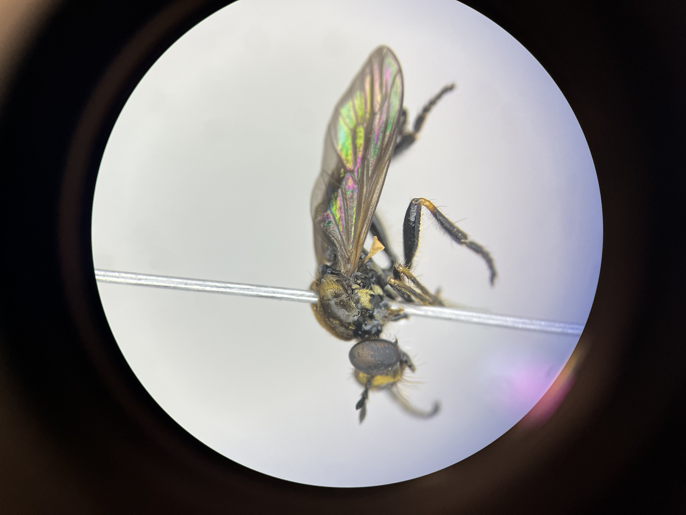
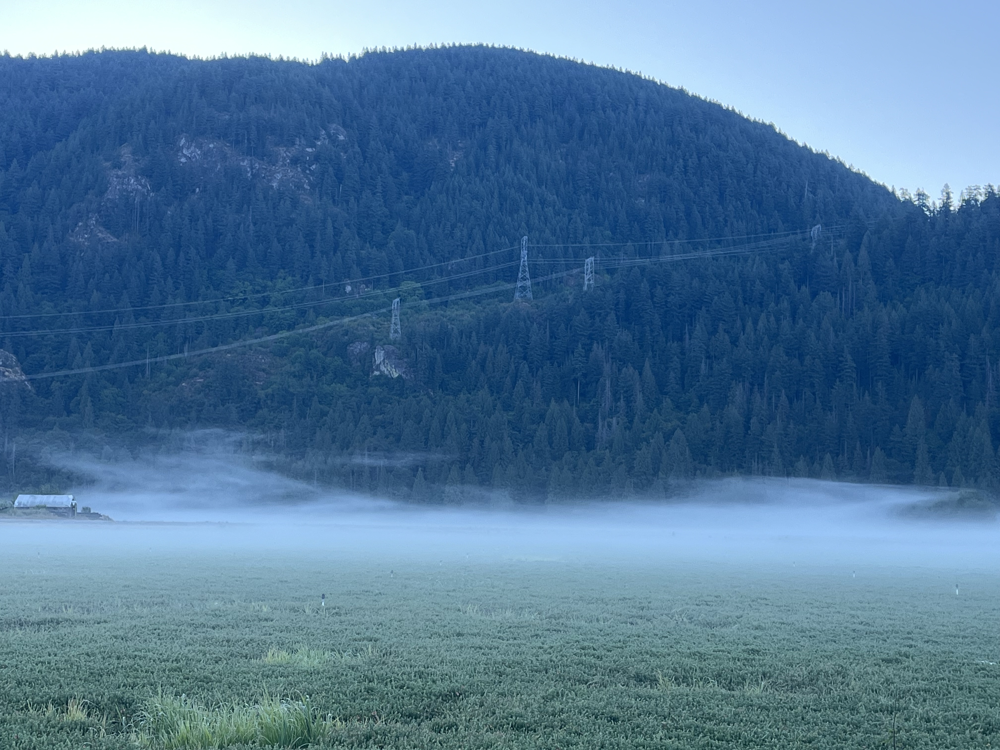
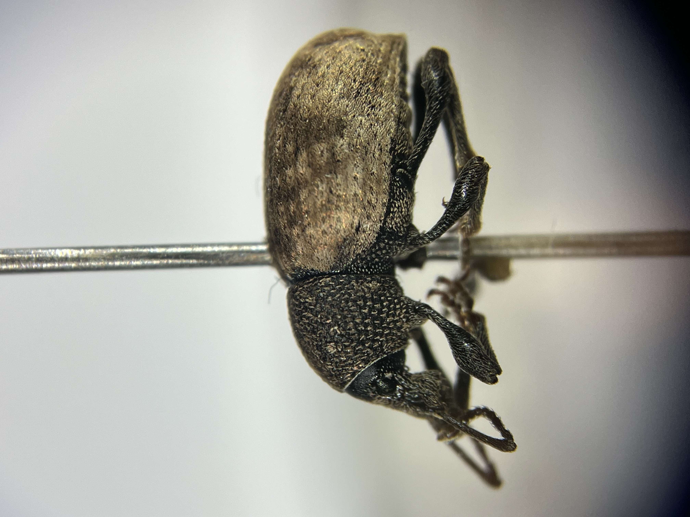
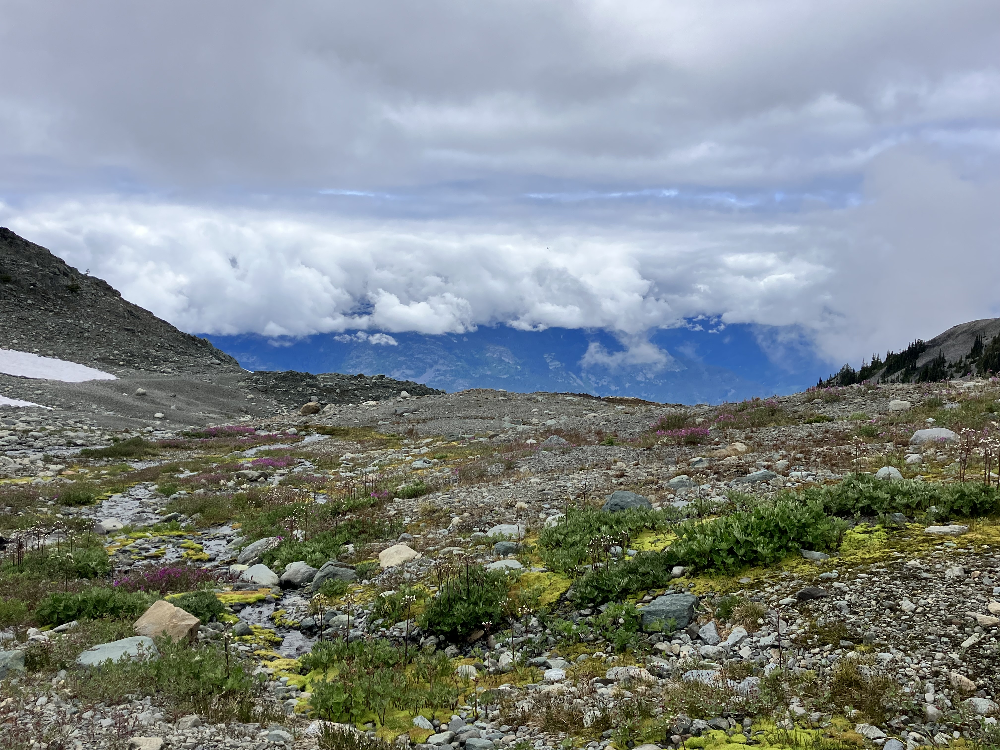
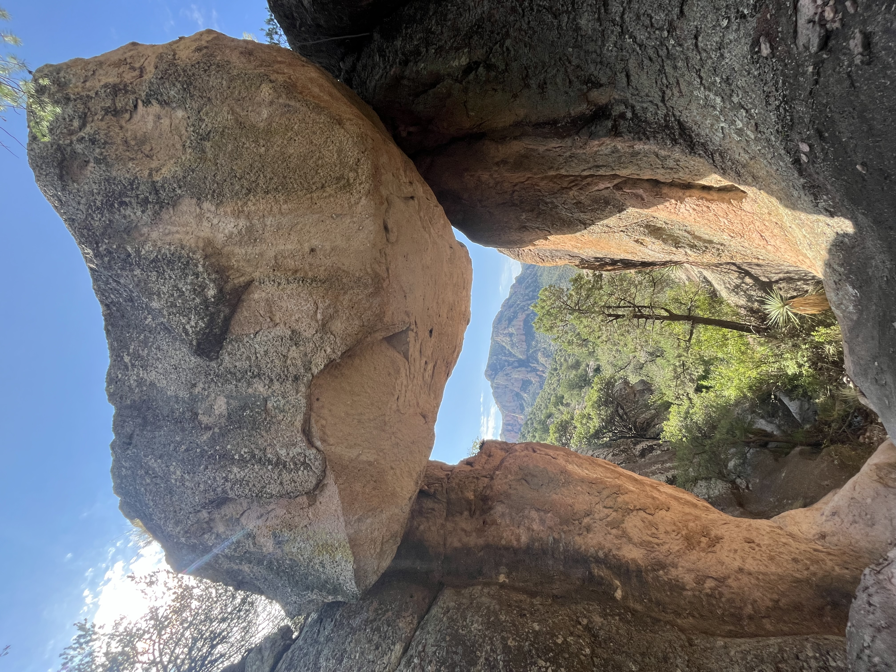

::: {.page-header}
# Photos! Insects, Life, Etc.
:::

::: {.section-container}

::: {.masonry-grid}

::: {.masonry-item}

{.masonry-photo}

::: {.photo-caption}
A robber fly at the Beaty Biodiversity Museum, *Eudioctria sackeni*
:::

:::

::: {.masonry-item}

{.masonry-photo}

::: {.photo-caption}
Cranberry field in Pitt Meadows, which I monitored for pests in.
:::

:::

::: {.masonry-item}

{.masonry-photo}

::: {.photo-caption}
A weevil at the Beaty.
:::

:::

::: {.masonry-item}

{.masonry-photo}

::: {.photo-caption}
At the top of Black Tusk Mountain in Garibaldi National Park for a Bioblitz!
:::

:::

::: {.masonry-item}

{.masonry-photo}

::: {.photo-caption}
Hike photo from my time at the Southwestern Research Station, Arizona.
:::

:::

:::

:::
